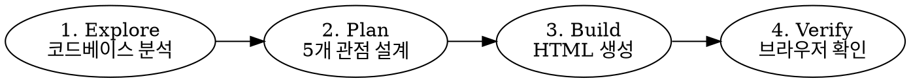

# Architecture Diagram Generator

프로젝트 코드베이스를 분석하여 **다크 테마 인터랙티브 HTML 아키텍처 다이어그램**을 생성하는 기술 스킬.

## Overview

단일 "Master 다이어그램" 대신 **5개 관점(perspectives)**으로 분리된 탭 기반 아키텍처 문서를 생성한다. 커스텀 HTML/CSS로 레이아웃을 완전히 제어하고, devicon CDN 아이콘으로 기술 스택을 시각화한다.

**핵심 원칙:** Mermaid 자동 레이아웃은 시퀀스 다이어그램에만 사용. 시스템 개요/인프라/파이프라인은 반드시 커스텀 HTML/CSS로 수동 레이아웃.

## When to Use

- 프로젝트의 전체 아키텍처를 시각적으로 문서화할 때
- 새 팀원 온보딩용 시스템 구조도가 필요할 때
- 기술 블로그/Notion에 아키텍처를 정리할 때
- 기존 Mermaid/draw.io 다이어그램이 복잡해서 읽기 어려울 때

**사용하지 않을 때:** 단순 플로우차트 1개만 필요한 경우 → Mermaid로 충분

## Pipeline



### Phase 1: Explore (Explore 서브에이전트 위임)

코드베이스에서 다음을 추출:
- **기술 스택**: 언어, 프레임워크, DB, 메시지 브로커
- **모듈 구조**: 주요 패키지/디렉토리, 각 역할
- **엔티티/도메인 모델**: 테이블, 관계, PK/FK
- **API 엔드포인트**: REST/GraphQL 구조
- **외부 서비스**: 인증, AI, 결제, 알림 등
- **인프라**: Docker, Nginx, DB, 캐시, 배포

### Phase 2: Plan (5개 관점 설계)

| 탭 | 내용 | 다이어그램 방식 |
|---|---|---|
| **System Overview** | 레이어별 컴포넌트 + 외부 서비스 | 커스텀 HTML/CSS |
| **Runtime Flow** | 주요 API 호출의 왕복 시퀀스 | Mermaid sequenceDiagram |
| **Data Model** | 엔티티 테이블 + 관계 | 커스텀 HTML 테이블 카드 |
| **Infrastructure** | Docker/K8s 컨테이너 구성 | 커스텀 HTML/CSS |
| **Pipeline** | 주요 파이프라인 흐름 (AI, CI/CD 등) | 커스텀 HTML/CSS |

### Phase 3: Build (HTML 생성)

`docs/architecture-diagrams.html` 단일 파일로 생성.
핵심 패턴은 아래 **Design System** 및 **HTML Patterns** 참조.

### Phase 4: Verify

`open docs/architecture-diagrams.html`로 브라우저에서 확인.
사용자 피드백 반영 후 완성.

## Design System

### Color Palette (다크 테마)

```
Background:  #06090f → #0c1220 → #131d2e (3단계 depth)
Border:      #1c2b3f (기본) / #253650 (light)
Text:        #e2e8f0 (기본) / #94a3b8 (dim) / #64748b (muted)
```

| 색상 | 용도 | HEX |
|------|------|-----|
| Blue | Client Layer | `#60a5fa` |
| Green | Edge / Infra | `#4ade80` |
| Purple | Backend | `#c084fc` |
| Orange | Data Layer | `#fb923c` |
| Cyan | External Services | `#22d3ee` |
| Pink | AI / Pipeline | `#f472b6` |
| Red | Security / Quota | `#f87171` |
| Yellow | PK Badge | `#fbbf24` |

### Icons (devicon CDN)

```
Base URL: https://cdn.jsdelivr.net/gh/devicons/devicon@latest/icons/{tech}/{tech}-original.svg
```

| 기술 | 경로 | 비고 |
|------|------|------|
| Swift | `swift/swift-original.svg` | |
| Kotlin | `kotlin/kotlin-original.svg` | |
| Spring | `spring/spring-original.svg` | |
| PostgreSQL | `postgresql/postgresql-original.svg` | |
| Redis | `redis/redis-original.svg` | |
| Nginx | `nginx/nginx-original.svg` | |
| Docker | `docker/docker-original.svg` | |
| Cloudflare | `cloudflare/cloudflare-original.svg` | |
| Apple | `apple/apple-original.svg` | 다크 배경: `style="filter:invert(1)"` |
| Google | `google/google-original.svg` | |
| Java | `java/java-original.svg` | |

**403 나는 아이콘** (telegram, letsencrypt): Wikimedia Commons SVG 사용
```
Telegram: https://upload.wikimedia.org/wikipedia/commons/8/82/Telegram_logo.svg
```

### Typography

```css
font-family: -apple-system, BlinkMacSystemFont, 'SF Pro Display', 'Segoe UI', system-ui, sans-serif;
/* 코드/기술 태그 */
font-family: 'SF Mono', 'Fira Code', monospace;
```

## HTML Patterns

### Layer Section (레이어 카드)

```html
<div class="layer layer-blue">
  <div class="layer-label lbl-blue">LAYER NAME</div>
  <div class="nodes">
    <div class="node">
      
      <div class="node-info">
        <div class="node-name">Resource Name</div>
        <div class="node-desc">Type &middot; Details</div>
      </div>
    </div>
  </div>
</div>
```

**핵심 CSS:**
- `.layer`: `background:var(--surface); border-radius:16px; backdrop-filter:blur(12px)`
- `.layer::before`: 그라디언트 보더 (`mask-composite:exclude`)
- `.node:hover`: `translateY(-1px)` + glow shadow

### SVG Connector Arrow (레이어 간 연결)

```html
<div class="connector">
  <svg width="2" height="16"><line x1="1" y1="0" x2="1" y2="16" stroke="url(#grad-blue)" stroke-width="2"/></svg>
  <div class="connector-label">HTTPS REST</div>
  <svg width="12" height="10"><polygon points="6,10 0,0 12,0" fill="var(--blue)" opacity="0.7"/></svg>
</div>
```

### Horizontal Connector (같은 레이어 내)

```html
<div class="hconnector">
  <svg width="32" height="12">
    <line x1="0" y1="6" x2="24" y2="6" stroke="var(--green)" stroke-width="2" opacity="0.6"/>
    <polygon points="32,6 22,1 22,11" fill="var(--green)" opacity="0.7"/>
  </svg>
</div>
```

### Module Grid (백엔드 모듈)

```html
<div class="module-grid">
  <div class="module">
    <div class="module-icon">&#128274;</div>
    <div>
      <div class="module-name">Auth</div>
      <div class="module-desc">JWT &middot; Apple/Google OIDC</div>
    </div>
  </div>
</div>
```

### ER Table Card (데이터 모델)

```html
<div class="er-table">
  <div class="er-table-header" style="background:rgba(96,165,250,0.08);color:var(--blue)">
     TABLE_NAME
  </div>
  <div class="er-row">
    <span class="er-col">id</span>
    <span><span class="er-type">UUID</span> <span class="er-badge er-pk">PK</span></span>
  </div>
</div>
```

### External Service Card

```html
<div class="ext">
  
  <div class="ext-name">Service Name</div>
  <div class="ext-desc">Description</div>
  <div class="ext-tag">apiMethod</div>
</div>
```

## Visual Enhancements

| 요소 | 기법 |
|------|------|
| 배경 | 도트 그리드 패턴 (`radial-gradient`, 24px 간격) |
| 헤더 타이틀 | 그라디언트 텍스트 (`background-clip:text`) |
| 레이어 보더 | CSS `mask-composite:exclude` 그라디언트 보더 |
| 탭 활성 | 하단 glow (`filter:blur(4px)`) |
| 탭 전환 | `fadeIn` 애니메이션 (0.25s) |
| 카드 hover | `translateY(-1px)` + subtle glow shadow |
| 코드 태그 | monospace + 반투명 배경 badge |

## Diagram Best Practices

[Ilograph "7 More Common Diagram Mistakes" 기반]

| # | 규칙 | 적용 방법 |
|---|------|----------|
| 1 | 리소스에 이름+타입 표기 | `node-name` + `node-desc` 분리 |
| 2 | 고립된 리소스 없음 | 모든 노드는 최소 1개 연결 |
| 3 | Master 다이어그램 금지 | 5개 관점 탭으로 분리 |
| 4 | 컨베이어 벨트 방지 | Runtime은 Mermaid 시퀀스로 왕복 표현 |
| 5 | 무의미한 애니메이션 금지 | 정적 다이어그램, 의미 있는 hover만 |
| 6 | Fan Trap 방지 | 중간 리소스 세분화 (예: Kafka → 토픽별) |
| 7 | AI 자동 생성 맹신 금지 | 결과물 반드시 검증 |

## Mermaid 사용 범위

**사용:** 시퀀스 다이어그램만 (Runtime Flow 탭)
```
sequenceDiagram
  actor User as iOS App
  participant NG as Nginx
  ...
```

**사용 금지:** 시스템 개요 Flowchart (자동 레이아웃이 복잡한 시스템에서 깨짐)

**Mermaid 설정:**
```javascript
mermaid.initialize({
  startOnLoad: true,
  theme: 'dark',
  themeVariables: {
    primaryColor: '#1f6feb',
    actorBkg: '#1e3a5f',
    actorTextColor: '#e2e8f0',
    // ... (전체 설정은 template.html 참조)
  },
  sequence: { useMaxWidth: true, mirrorActors: false }
});
```

## D2 대안 (선택)

D2 CLI가 설치된 경우 (`brew install d2`) 추가 SVG 렌더링 가능:

```bash
d2 --dark-theme 200 --pad 40 -l elk diagram.d2 diagram.svg
```

- **장점**: 텍스트 기반 → git 버전 관리, ELK 레이아웃 우수
- **단점**: HTML 인터랙션 불가, 별도 파일
- **판단**: 인터랙티브 HTML이 메인, D2는 보조/빠른 스케치용

## Common Mistakes

| 실수 | 해결 |
|------|------|
| Mermaid로 시스템 개요 그림 | 커스텀 HTML/CSS 사용 |
| devicon 아이콘 403 | Wikimedia Commons SVG 폴백 |
| 레이어 간 연결이 CSS 블록 | SVG polygon 화살표 사용 |
| 한 페이지에 모든 정보 | 5개 탭으로 분리 |
| 아이콘 없이 텍스트만 | devicon CDN 필수 |
| 밝은 테마 | 다크 테마가 기술 문서 표준 |
| 연결 설명 누락 | `connections-list` 카드로 관계 설명 |

## Quick Reference

```
Output: docs/architecture-diagrams.html
Icons:  cdn.jsdelivr.net/gh/devicons/devicon@latest/icons/{tech}/{tech}-original.svg
Tabs:   Overview | Runtime | Data | Infra | Pipeline
Theme:  Dark (#06090f base)
Arrows: SVG polygon (not CSS)
Seq:    Mermaid (sequence only)
Layout: CSS Grid + manual positioning
```
